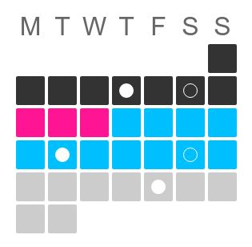

# Marama



_From te reo maori: [marama](http://maoridictionary.co.nz/search?keywords=moon) - 1. moon, 2. month_ 

## Uasge

```js
var Marama = require('marama')
require('marama/lib/styles-inject')()

const marama = Marama({
  events: [
    { date: new Date(2018, 3, 4), data: { attending: false } },
    { date: new Date(2018, 7, 21), data: { attending: true } }
    // NOTE Date has signatute (Year, monthIndex, day)
  ],
  range: {
    gte: new Date(2018, 7, 13),
    lt: new Date(2018, 7, 20) // range of highlighted dates
  },
  styles: {
    tileRadius: 18,
    tileGap: 4
  }
})

document.body.appendChild(marama)
```


## API

Marama can take the following opts (all optional):

```js
{
  events      // an Array of form: [Event, Event, ... ]  (default: [])
  monthIndex, // month by index e.g. 3 = April                      (default: current month)
  year,       // year we're in                                      (default: current year)
  today       // a Date which can be used to over-ride the definition of today
  range,      // a range to highlight, expects Object of form { gte: Date, lt: Date } (default: null}
  onSelect,   // a callback function _see below_
  styles,     // Object, _see below_
}
```

An `Event` is an object with form `{ date: Date, data: { attending: Boolean, ... } }`

**Note** that if `today` is set, the "current month" and "current year" defaults will be based on this.

### `onSelect`

A function that is called with data of the form : `{ gte: Date, lt: Date, events: Array }`, where:
  - `events` is an Array of all events in the range between `gte` and `lt`
  - `gte` and `lte` are the lower and upper bounds of a range defined by what you clicked on

**Note** the window of time for a left-click is 1 day wide, but marama also listens for a _shift-click_.
A shift-click takes any currently defined `range` and stretches it out to the point you've shift-clicked.
By managing state outside of marama, it's possible to make some nice interactive featureswith this.


### `styles`

The `styles` option can be used to change how Marama looks programmatically

```js
{
  tileRadius, // (optional) Number, half-width of a day-tile, in px (default 6)
  tileGap,    // (optional) Number, gap between day-tiles, in px (default: 1)
  dotRadius,  // (optional) Number, radius of the 'attendance' dot in px (default: tileRadius/2)
  dotBorder,  // (optional) Number, depth of outline on an event not attending (default: 1) 
  weekFormat, // (optional) String(rows|columns), which direction weeks run in (default: rows)
}
```
